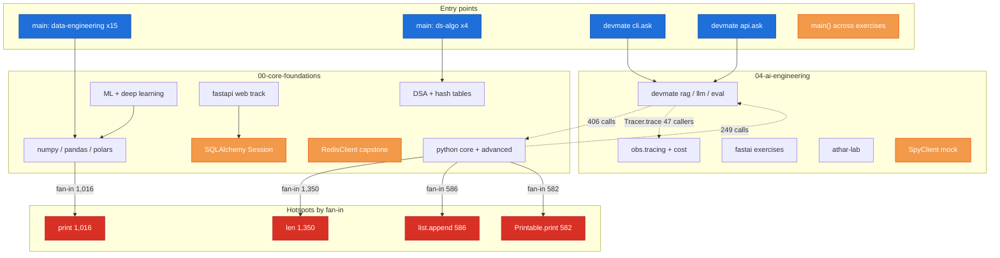

# Code Intelligence

Multi-layered code intelligence powered by codebase-memory-mcp, code-review-graph,
graphify, and repomix.

## Status

| Layer | Status | Details |
|-------|--------|---------|
| **Structural Graph** | ✅ Refreshed 2026-10-02 | `D-AI-Projects-fullstack-ai-engineer-lab`, **67,084 nodes, 148,492 edges**, 8 languages |
| **Review Graph** | ✅ Rebuilt 2026-10-02 | 12,984 nodes, 95,601 edges, 23 communities, 1,147 flows; built at `78d12fb`, `head_matches_build: true` |
| **Multimodal Graph** | ✅ Built | 49,856 nodes, 54,483 edges, 2,833 communities (AST-only, no LLM) |
| **Context Pack** | ✅ Ready | 1,244,995 tokens (compressed), 1,082 files |
| **Watcher** | ⏳ Manual | Re-index with `codebase-memory index_repository` after large edits |

**Structural project name:** `D-AI-Projects-fullstack-ai-engineer-lab`
**Root:** `D:/AI/Projects/fullstack-ai-engineer-lab` · branch `master`

### Refresh notes (2026-10-02)

- Growth from lecture/quiz commits: nodes 60,751 → **67,084** (+6,333),
  edges 141,083 → **148,492** (+7,409).
- `parse_partial`: 7 files (infra sql/conf/ps1, `practice_no_solutions.py`,
  `pytest.ini`). `skipped`: 0.
- Review graph rebuilt same day at `78d12fb`: nodes 11,590 → **12,984**,
  edges 87,721 → **95,601**; files 932 → 1,180. Communities (23) and
  flows (1,147) unchanged.
- Graphify unchanged: 49,856 nodes / 54,483 edges / 2,833 communities.
- Hotspots, boundaries, and clusters re-pulled from `get_architecture`
  (`len` fan-in 1,211 → 1,350; `print` 893 → 1,016; cluster IDs renumbered).

### Reindex notes (2026-09-30)

- Full reindex after DevMate eval package + roadmap docs landed.
- Nodes 60,577 → **60,751**; edges 140,909 → **141,083**.
- `parse_partial`: 7 files (infra sql/conf/ps1 + a few curriculum files) — not DevMate eval.
- `skipped`: 0.
- By-design exclusions include `.venv`, `__pycache__`, `.env`, gitignored assets.
- `evaluations/rag/datasets` is currently in not-indexed dirs — golden JSONL is **not** in
  the graph; read those files from the filesystem.
- Uncommitted work still reports `freshness: metadata_changed` on coverage checks until
  committed and reindexed.

### DevMate call-graph after retrace

| Symbol | Callers | Callees | Notes |
| ------ | ------- | ------- | ----- |
| `get_rag_pipeline` | 8 | 1 | API (`ask`/`ingest`/`lifespan`/`rag_query`) + CLI |
| `RAGPipeline.query` | 5 | 33 | hybrid search, tracer, LLM complete, context builders |
| `Tracer.trace` | 47 | 6 | API, CLI, RAG, agents, guards, embeddings, eval live path |
| `Retriever.retrieve` | 15 | 16 | hybrid_search + RRF + rerank; also `eval.run_ragas` live path |
| `score_retrieval` | 3+ | 4 | `run_offline`, `run_live`, `amain` |
| `LLMClient.complete` | 0 in graph | 3 | Lazy `get_llm_client()` + provider dict — **use source, not inbound CALLS** |
| `run_ragas` | module node | 14 | Indexed as Module 1–386; function-level edges resolve via callees |

### Architecture



### Key Hotspots

| Symbol | Type | Fan-in | Why |
|--------|------|--------|-----|
| `len` | builtin | 1,350 | Most-called function across exercises |
| `print` | builtin | 1,016 | Output everywhere |
| `list.append` | builtin | 586 | Core data-structure operation |
| `Printable.print` | method | 582 | ABC pattern demo in `08-abc` |
| `HashTable.items` | method | 258 | DSA hash-table exercise |
| `FileManager.append` | method | 199 | File-manager capstone |
| `dict.get` | builtin | 190 | Dictionary lookup pattern |
| `AsyncDB.close` | method | 159 | FastAPI async-DB exercise |
| `ConnectionManager.connect` | method | 158 | FastAPI websockets exercise |

### Cross-Package Boundaries

| From | To | Calls |
|------|----|-------|
| 00-core-foundations | builtins (`len`) | 763 |
| 00-core-foundations | builtins (`print`) | 715 |
| 04-ai-engineering | 00-core-foundations | 406 |
| 04-ai-engineering | builtins (`len`) | 406 |
| 00-core-foundations | 04-ai-engineering | 249 |

### Clusters (12 from codebase-memory)

| Cluster | Size | Cohesion | Dominant |
|---------|------|----------|----------|
| 5 | 548 | 0.47 | len, range, split, main, analyze |
| 16 | 534 | 0.57 | print, connect, execute, close, get |
| 9 | 279 | 0.46 | append, pop, main, _verify |
| 21 | 255 | 0.67 | get, _purge, _verify, append |
| 6 | 251 | 0.53 | str, search, stats, resolve, _ingest_async |
| 18 | 243 | 0.62 | list, _verify, parse_sse_stream, dedupe_chunks |
| 29 | 214 | 0.71 | commit, select, Session, add |
| 19 | 170 | 0.61 | dict, collect, _verify, execute |
| 20 | 155 | 0.61 | lower, main, upper, _verify, run |
| 17 | 153 | 0.57 | int, _verify, run_with_bulkhead |
| 37 | 147 | 0.77 | filter, count, ValidationError, is_valid |
| 107 | 146 | 0.66 | encode, decode, _verify, main |

### Communities (23 from code-review-graph)

| Community | Size | Cohesion | Language |
|-----------|------|----------|----------|
| challenges-demo | 2,232 | 0.23 | Python |
| 10-repository-pattern-verify | 1,252 | 0.24 | Python |
| practice-problem | 1,201 | 0.20 | Python |
| exercises-user | 1,160 | 0.15 | Python |
| 23-ml-visualization-exercise | 1,031 | 0.07 | Python |
| exercises-agent | 605 | 0.31 | Python |
| 04-queues-sort | 577 | 0.27 | Python |
| exercises-demo | 538 | 0.25 | Python |
| exercises-demo-agent | 430 | 0.31 | Python |
| llm-count | 375 | 0.32 | Python |
| practice-problem-agent | 346 | 0.60 | Python |
| 09-genai-verify | 296 | 0.31 | Python |
| 08-mlops-verify | 180 | 0.34 | Python |
| exercises-train | 162 | 0.18 | Python |
| 01-calculator-task | 74 | 0.17 | Python |

### God Nodes (graphify, top 10)

| Node | Edges | What it is |
|------|-------|------------|
| `RedisClient` | 110 | Redis connection wrapper (capstone infra) |
| `main()` | 100 | Entry points across all exercises |
| `Session` | 94 | SQLAlchemy session (database exercises) |
| `SpyClient` | 31 | Testing mock (observability exercises) |
| `Glossary: Data Ethics` | 31 | fast.ai lecture glossary |
| `BST` | 29 | Binary search tree (DSA) |
| `AVLTree` | 26 | Self-balancing tree (DSA) |
| `Detailed Definitions` | 29 | fast.ai glossary node |
| `Terms` | 28 | fast.ai glossary node |
| `Definitions` | 27 | fast.ai glossary node |

## Quick Reference

| Question | Tool call |
|----------|----------|
| Who calls X? | `codebase-memory_trace_path(function_name="X", direction="inbound")` |
| What does X call? | `codebase-memory_trace_path(function_name="X", direction="outbound")` |
| Find by pattern | `codebase-memory_search_graph(name_pattern=".*X.*")` |
| Dead code | `codebase-memory_search_graph(max_degree=0)` |
| Impact of changes | `codebase-memory_detect_changes(project="D-AI-Projects-fullstack-ai-engineer-lab")` |
| Blast radius | `code-review-graph_detect_changes_tool(detail_level="minimal")` |
| Critical flows | `code-review-graph_list_flows_tool(sort_by="criticality", detail_level="minimal")` |
| Community details | `code-review-graph_get_community_tool(community_name="X")` |
| God nodes | `graphify_god_nodes()` |
| Shortest path | `graphify_shortest_path(from="X", to="Y")` |
| Pack for LLM | `repomix_pack_codebase(path="D:\\AI\\Projects\\fullstack-ai-engineer-lab")` |

## How to re-index

```bash
# Structural graph (codebase-memory-mcp)
codebase-memory index_repository --repo_path D:\AI\Projects\fullstack-ai-engineer-lab --mode full

# Review graph (code-review-graph)
# Built automatically on first query, or trigger manually:
code-review-graph build_or_update_graph_tool

# Multimodal graph (graphify)
graphify update . --force
```

## What it covers

- **Python** (1,126 files in structural graph language counts): core, advanced, libraries,
  databases, web frameworks, DSA, ML, MLOps, GenAI, DevMate package + unit tests
- **Markdown** (extensive): lectures, quizzes, ADRs, roadmaps, learning paths
- **HTML/CSS/JS / YAML / TOML / SQL**: templates, compose, CI, registries, init scripts

## Agent tiers

| Tier | When to use | Tools |
|------|-------------|-------|
| **Scout** | Quick lookup, provisional | graph + repomix tools |
| **Verify** | Task-directed evidence | graph + coverage checks + exact snippets |
| **Auditor** | Full bounded verification | All tools, complete pagination |

*Last updated: 2026-10-02 (cbm-refresh: structural 67,084 nodes, review graph rebuilt)*
